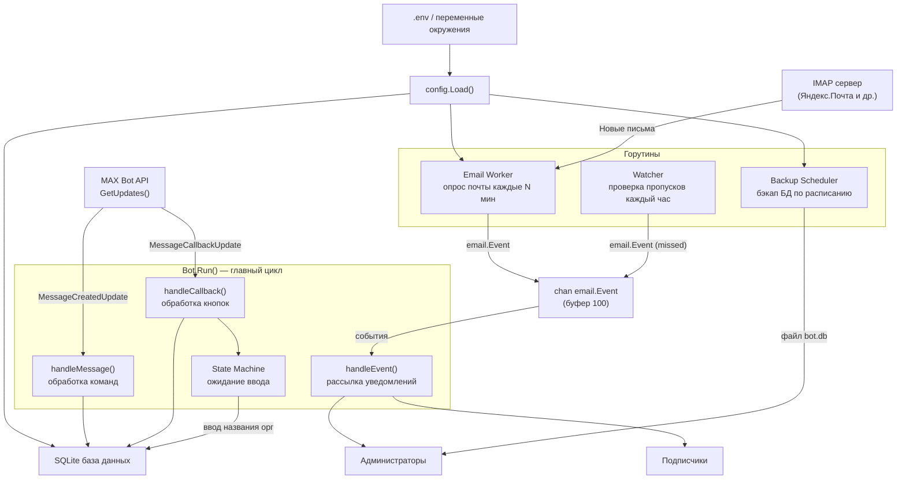
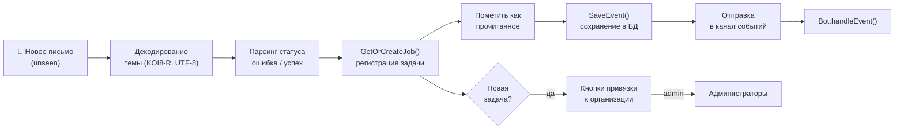
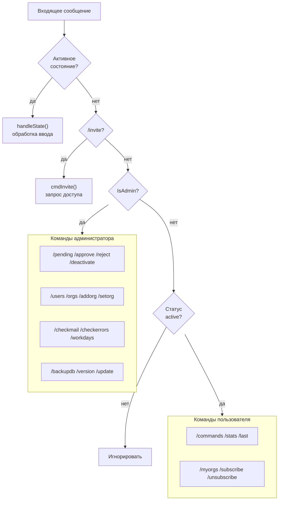
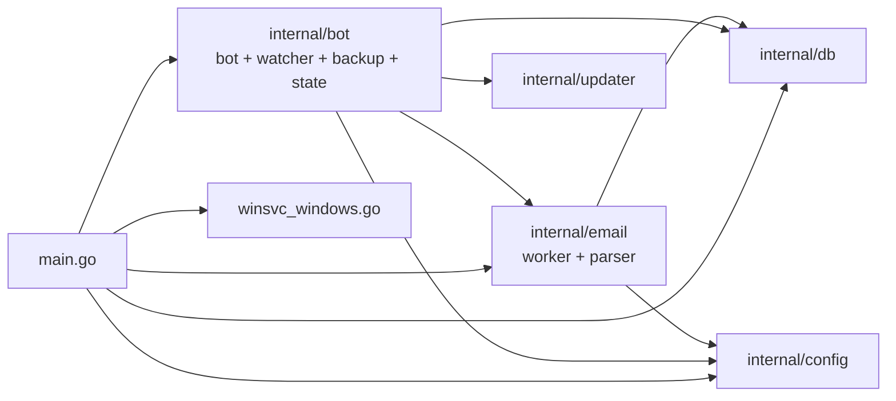

# MAX Backup Notifier Bot

Бот для мессенджера MAX, который мониторит письма от Iperius Backup через IMAP и рассылает уведомления об успешных и неуспешных бэкапах подписчикам.

---

## Содержание

- [Требования](#требования)
- [Настройка](#настройка)
- [Запуск](#запуск)
- [Команды бота](#команды-бота)
- [Как это работает](#как-это-работает)
- [Архитектура](#архитектура)
- [Автозапуск на Windows](#автозапуск-на-windows)

---

## Требования

- Токен MAX бота (получить через MasterBot в мессенджере MAX)
- Яндекс почта с паролем приложения (или другой IMAP сервер)
- Windows x64 / Linux / macOS — Go и SQLite встроены в бинарник, ничего дополнительно устанавливать не нужно

---

## Настройка

Создать файл `.env` рядом с исполняемым файлом:

```env
BOT_TOKEN=ваш_токен_бота
ADMIN_USER_IDS=123456789,987654321
IMAP_HOST=imap.yandex.ru
IMAP_PORT=993
IMAP_USER=backup@yandex.ru
IMAP_PASSWORD=пароль_приложения
IMAP_FOLDER=beckup
EMAIL_POLL_INTERVAL=5
DB_PATH=./data/bot.db
TIMEZONE=Asia/Almaty
DB_BACKUP_TIME=02:00
```

### Описание параметров

| Параметр | Обязательный | Описание |
|----------|:---:|---------|
| `BOT_TOKEN` | ✅ | Токен MAX бота. Получить: открыть MasterBot в MAX → создать бота → скопировать токен |
| `ADMIN_USER_IDS` | ✅ | ID администраторов через запятую. Узнать свой ID: написать боту `/start` — он ответит с вашим ID. Можно указать несколько: `123,456,789` |
| `IMAP_HOST` | ✅ | Адрес IMAP сервера. Для Яндекса: `imap.yandex.ru` |
| `IMAP_PORT` | ✅ | Порт IMAP (TLS). Для Яндекса: `993` |
| `IMAP_USER` | ✅ | Email адрес для подключения к почте |
| `IMAP_PASSWORD` | ✅ | Пароль приложения Яндекс (не основной пароль). Создать: Яндекс ID → Безопасность → Пароли приложений |
| `IMAP_FOLDER` | ❌ | Папка IMAP для проверки писем. По умолчанию: `INBOX` |
| `EMAIL_POLL_INTERVAL` | ❌ | Интервал автоматической проверки почты в минутах. По умолчанию: `5` |
| `DB_PATH` | ❌ | Путь к файлу базы данных SQLite. По умолчанию: `./data/bot.db`. Папка создаётся автоматически |
| `TIMEZONE` | ❌ | Часовой пояс в формате IANA. Например: `Europe/Moscow`, `Asia/Almaty`, `UTC`. По умолчанию: системный |
| `DB_BACKUP_TIME` | ❌ | Время автоматической отправки бэкапа БД админам в формате `HH:MM`. Например: `02:00`. Если не задан — автобэкап отключён |

---

## Запуск

### Windows

```
max-notification.exe
```

Или двойной клик на файл. При первом запуске автоматически создаётся папка `data/` с базой данных.

### Linux / macOS

```bash
./max-notification
```

---

## Команды бота

### Публичные команды (доступны всем)

#### `/start`
Приветственное сообщение. Подскажет как запросить доступ.

#### `/invite`
Запрос доступа к боту. Администратор получит уведомление и сможет одобрить или отклонить заявку.
- Если заявка уже отправлена — сообщит текущий статус
- Если доступ уже есть — сообщит об этом

---

### Команды для активных пользователей

#### `/stats`
Статистика бэкапов за 7 и 30 дней по каждой задаче из подписанных организаций.

```
📊 Статистика за 7 дней:
MyJob: ✅ 6  ❌ 1  ⚠️ 0

За 30 дней:
MyJob: ✅ 24  ❌ 2  ⚠️ 1
```

Администратор видит статистику по всем задачам без ограничений.

#### `/last`
Последние 10 событий бэкапов из подписанных организаций.

```
✅ MyJob — 2026-04-02 14:30
❌ MyJob — 2026-04-02 02:00
⚠️ MyJob — 2026-04-01 14:00
```

#### `/myorgs`
Список организаций, на которые вы подписаны.

#### `/subscribe <название>`
Подписаться на уведомления организации. Пример: `/subscribe Главный офис`

#### `/unsubscribe <название>`
Отписаться от уведомлений организации. Пример: `/unsubscribe Главный офис`

---

### Команды администратора

#### `/pending`
Список пользователей с ожидающими заявками на доступ. Показывает имя, username и ID каждого.

#### `/approve <user_id>`
Одобрить заявку пользователя. Пользователь получит уведомление об одобрении.
Пример: `/approve 123456789`

#### `/reject <user_id>`
Отклонить заявку пользователя. Пользователь получит уведомление об отклонении.
Пример: `/reject 123456789`

#### `/deactivate <user_id>`
Деактивировать активного пользователя. Пользователь получит уведомление и потеряет доступ. Может повторно подать заявку через `/invite`.
Пример: `/deactivate 123456789`

#### `/users`
Список всех активных пользователей с их подписками на организации.

#### `/orgs`
Список всех организаций с привязанными задачами бэкапов. Также показывает задачи без организации.

#### `/addorg <название>`
Создать новую организацию. Пример: `/addorg Главный офис`

#### `/setorg "<название задачи>" <название организации>`
Привязать задачу бэкапа к организации. Название задачи берётся из темы письма от Iperius.

Пример: `/setorg "Backup Server 1 - Главный офис" Главный офис`

Если название задачи без пробелов, кавычки можно опустить: `/setorg BackupJob Главный офис`

#### `/checkmail`
Немедленно проверить почту не дожидаясь следующего автоматического опроса. Сообщит сколько новых писем обработано.

#### `/checkmail <дата>`
Показать все события бэкапов за указанную дату из базы данных.
Пример: `/checkmail 2026-04-02`

```
📋 События за 2026-04-02:
✅ MyJob — 08:15
❌ MyJob — 14:30
```

#### `/checkerrors`
Показать все ошибки и пропущенные бэкапы за последние 24 часа.

```
⚠️ Проблемы за последние 24ч (2):
❌ MyJob — 02.04 14:30
⚠️ OtherJob — 02.04 08:00
```

#### `/workdays <название организации>`
Настроить рабочие дни для организации. Откроет интерактивную клавиатуру с днями недели — нажатие на день включает или выключает его.

Пример: `/workdays Главный офис`

Если рабочие дни не заданы — бот ожидает бэкапы каждый день. Если заданы — в нерабочие дни бот не будет отправлять предупреждения о пропущенных бэкапах.

#### `/backupdb`
Немедленно отправить файл базы данных (`bot.db`) всем администраторам. Удобно для ручного создания резервной копии.

Автоматический бэкап настраивается через `DB_BACKUP_TIME` в `.env` — бот будет отправлять файл каждый день в указанное время.

#### `/version`
Показать текущую версию бота и проверить наличие обновления на GitHub.

```
Текущая версия: v1.0.2
🆕 Доступна новая версия: v1.0.3
Обновить: /update
```

#### `/update`
Скачать и установить последнюю версию с GitHub Releases. Бот скачивает новый бинарник, создаёт скрипт замены и перезапускается автоматически (только Windows).

#### `/commands`
Показать список всех доступных команд. Администратору показываются также административные команды.

---

## Как это работает

### Определение статуса бэкапа

Бот анализирует тему и тело письма от Iperius. Если найдено любое из слов: `error`, `failure`, `failed`, `ошибка`, `сбой`, `не удалось`, `завершено с ошибками` — статус `❌ ошибка`. Иначе — `✅ успешно`.

### Регистрация новых задач

При получении письма от неизвестной задачи бот автоматически регистрирует её и уведомляет администратора:

```
⚙️ Новая задача зарегистрирована: "Backup Server 1". Привяжите её к организации:
/setorg "Backup Server 1" <org_name>
```

До привязки к организации уведомления о задаче получают только администраторы.

### Обнаружение пропущенных бэкапов

Бот раз в час проверяет задачи у которых давно не было активности. Если с последнего письма прошло больше двух средних интервалов — отправляет предупреждение `⚠️`. Средний интервал вычисляется по последним 10 письмам.

В нерабочие дни (настраиваются через `/workdays`) предупреждения не отправляются.

### Уведомления

При каждом новом событии бэкапа уведомление получают:
- Все администраторы — всегда
- Активные пользователи, подписанные на организацию задачи

Формат уведомлений:
```
✅ MyJob — успешно [2026-04-02 14:30]
❌ MyJob — ошибка: текст из письма [2026-04-02 14:30]
⚠️ MyJob — нет активности 26ч (ожидалось ~12ч) [2026-04-02 14:30]
```

---

## Архитектура

### Общая схема работы



### Поток обработки письма



### Маршрутизация команд



### Структура модулей



---

## Автозапуск на Windows

### Через Планировщик задач

1. Открыть «Планировщик задач» → «Создать задачу»
2. Триггер: «При запуске системы»
3. Действие: запустить `max-notification.exe` с указанием рабочей папки
4. Поставить галку «Выполнять независимо от регистрации пользователя»

### Через sc.exe (встроен в Windows, рекомендуется)

Бот поддерживает нативный запуск как Windows-служба. Выполнить от имени администратора:

```cmd
sc create MaxNotificationBot binPath= "C:\path\to\max-notification.exe" start= auto
sc description MaxNotificationBot "MAX Backup Notifier Bot"
sc start MaxNotificationBot
```

Управление службой:

```cmd
sc stop MaxNotificationBot
sc start MaxNotificationBot
sc delete MaxNotificationBot
```

> **Важно:** рабочая папка службы по умолчанию `C:\Windows\System32`, поэтому в `.env` укажите абсолютный путь к БД:
> ```env
> DB_PATH=C:\path\to\data\bot.db
> ```

### Через NSSM

[NSSM](https://nssm.cc) позволяет запустить бот как службу Windows:

```cmd
nssm install MaxNotificationBot C:\path\to\max-notification.exe
nssm set MaxNotificationBot AppDirectory C:\path\to\
nssm start MaxNotificationBot
```
